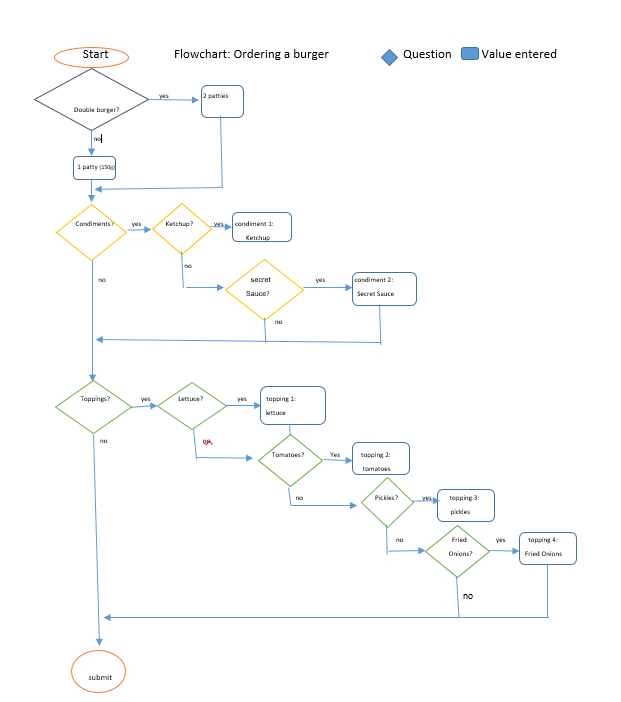

# OBWFinalPOC
LauraClass
# Introduction 
The owners of The General Putnam Motel Diner are creating an app that will allow their patrons to order their meals via a tablet placed on the tables at the restaurant.  As Corona caused the diner to close its doors to the public, this app will enable the Diners' customers to place takeout orders. 
This API provides a proof of concept (POC) to demonstrate how one item on the menu (the Burger Meal) is ordered and received by the kitchen staff, and the responses the system generates once an order is received. Once this API is approved by the owners of The General Putnam Motel Diner, a new application will be created to include the entire menu.


### POC work flow for ordering the burger component of the burgermeal

 


# Authentication 
JSON Web Token (JWT)
# Errors 
The General Putnam Motel Diner API follows standard HTTP status codes for success or failure of an API call. 

|Status|	Code Description|
|------|---------|
200 - OK|	Your meal was successfully ordered.
400 - Bad Request|	Your order was unacceptable. The server could not understand the request due to invalid syntax. Most likely, you made unsupported additions to the meal request.
401 - Unauthorized	|The user must authenticate itself to get the requested response.
402 - Request Failed	|Your order was not received. Unstable Internet connection or a problem with the server is a likely cause.
403 - Forbidden	|Order of item not served during the time order was made. For example: order of burgerMeal during the breakfast time.  
404 - Not Found	|The meal modifications you requested were not found. Order cannot be completed as is  
429 - Too Many Requests|	The user has sent too many requests in a given amount of time ("rate limiting").


# Rate Limits 
The General Putnam Motel Diner API will support sending multiple orders in a single request, with a maximum of 6 orders per request. This is not the case for the POC API. The POC API is only for ordering an individual burgermeal.
# Content Type 
Accept: application/json 
Content-Type: application/json 
# Dates & Times 
All times are represented in Eastern Standard Time (EST). 
All dates are in ISO 8601 format: YYYY-MM-DDThh:mmTZD 
## Meal Times 
Each meal type has a specific time range in which you can order it. 

Meal Type	|ISO 8601 Time Range	|Time
------|-------|--------
Breakfast|	YYYY-MM-DDT06:00:00-05:00 - YYYY-MM-DDT11:59:59-05:00	|06:00 - 11:59
Lunch|	YYYY-MM-DDT12:00:00-05:00 - YYYY-MM-DDT16:59:59-05:00	|12:00 - 16:59
Dinner|	YYYY-MM-DDT17:00:00-05:00 - YYYY-MM-DDT23:59:59-05:00 	|17:00 - 23:59

# Currency 
All prices are in United States dollar (USD). 
# Base URI 
https://api.gpmd.com 
# Resources 
The General Putnam Motel Diner API contains the following resources. 
## Meals 
Meals are how you order food at the General Putnam Motel Diner. 
## GET/ tableNo
This GET is used to get the bill for the customer based on the table number of the customer. The number 99 represents takeout orders. 

Property	|Data Type|	Description
------|--------|--------
orderNum|	UUiD|	Specifies the order number – automatically generated by server. 	 
timestamp|	Date	|All dates are in ISO 8601 format: YYYY-MM-DDThh:mmTZD 
Item	|int|	Specifies the itemOrdered placement on the bill
ItemOrdered|	string	|Specifies the mealType ordered. Acceptable response: BurgerMeal, Salad, ChickenMeal, FishNChips, none. Menu items available change based on timestamp of order. For Example: Lunch Menu 12:00-17:00	
Cost	|float	|Specifies the cost of the meal. Shows two decimal places.	

 ## Response Schema 

``` JSON


curl -X GET "http://URL/tableNo?id=99"
# response
{
   "orderNum":123,
   "timestamp":"2020-01-21T07:44:45-05:00",
   "Item1":{
  	"ItemOrdered":{
     	"type":"burgerMeal",
     	"Cost":10.99
  	}
   },
   "Item2":{
  	"ItemOrdered":{
     	"type":"salad",
     	"Cost":9.50
  	}
   }
}


```


## POST Response Example
### POST / mealType Properties

Property|	Data Type	|Description	|Default
---------|----------|------------|--------
mealType|	string	|Specifies the type of meal served based on timestamp. Acceptable response: "Breakfast", "Lunch", "Dinner" |	Lunch
mealCat	|string	|Specifies the meal Category offered. Acceptable response: "appetizers", "main",  "desserts"|	main
main	|string	|Specifies the main ordered. Only acceptable response: "burgerMeal" (This is just for the POC)	|burgerMeal

### POST / meal/lunch/burgerMeal/burger Properties

Property| Data Type|	Description	|Default
---------|-------|------|-------
pattyType|	string	|Specifies the type of burger. Can be "beef" or "veggie". | 	"beef"
pattyQty	|int|	Specifies the number of patties to prepare for order. Acceptable values are 1-2. |	1
pattyWeightG	|int|	Specifies the weight of the burger patties. 150g for a single patty, 300g for double burger	|150
PattyCook	|string	|Specifies the way the burger is made. Can be WD (well done), M (medium), MR (medium-rare), R (rare) |	"M"
BunType	|string|	Specifies the type of bun used. Could be white bread or whole wheat  |	"white"
Condiment1	|string	|Specifies the type of condiment placed on the patty. Acceptable response: none, ketchup, secretSauce. If "none" is chosen, then condiment2 will be automatically "none" as well.	|"none"
Condiment2|	string|	Specifies the type of condiment placed on the patty. Acceptable response: none, ketchup, secretSauce	|"none"
Topping1	|string	|Specifies topping added to burger patty(s). Acceptable response: none, lettuce, tomatoes, pickles, friedOnions. If "none" is chosen, then Topping2, topping3, topping4 will be automatically "none" as well.|	"none"
Topping2	|string	|Specifies topping added to burger patty(s). Acceptable response: none, lettuce, tomatoes, pickles, friedOnions. If "none" is chosen, then topping3, topping4 will be automatically "none" as well.	|"none"
Topping3|	string|	Specifies topping added to burger patty(s). Acceptable response: none, lettuce, tomatoes, pickles, friedOnions. If "none" is chosen, then topping4 will be automatically "none" as well.	|"none"
Topping4	|string|	Specifies topping added to burger patty(s). Acceptable response: none, lettuce, tomatoes, pickles, friedOnions.	|"none"

### POST / meal/lunch/burgerMeal/sides Properties

Property|	Data Type|	Description	|Default
-------|-----|------|------
Side1Type|	string|	Specifies the side type to come with the burger. Can be "frenchFries" or "onionRings" or "none". If "none"- size1 will be ""; side2Type will be "none"; side2Size will be ""|	"frenchFries"
Size1|	string	|Specifies the size of side1 order. Acceptable response: "small", "large", or ""	|small
Side2Type	|string	|Specifies the side type to come with the burger. Can be "frenchFries" or "onionRings" or "none". If "none"- size2 will be ""	|none
Size2|	string	|Specifies the size of side2 order. Acceptable response: "small", "large",  ""|	""

### POST / meal/lunch/burgerMeal/drink Properties

Property	|Data Type	|Description	|Default
--------|-------|-------|--------
drinkType|	string	|Specifies the drink type to come with the burger. Can be "Coke" or "Dietcoke", "Sprite" or "none". If "none"- size1 and Ice will be "". |	none
Size|	string|	Specifies the size of drinkType order. Acceptable response: "small", "large",  ""	|large
Ice|	string|	Specifies whether drinkType will include ice. Acceptable response: "yes", "no", ""	|yes


# Response Schema 
``` JSON
curl -H "Content-Type: application/json" -X POST -d'{
   "mealType":"lunch",
   "mealCat":{
  	"main":"burgerMeal",
  	"burger":{
     	"pattyType":"beef",
     	"pattyQty":1,
     	"pattyWeightG":300,
     	"pattyCook":"MR",
     	"bunType":"wholeWheat",
     	"condiment1":"ketchup",
     	"condiment2":"secretSauce",
     	"topping1":"lettuce",
     	"topping2":"pickles",
     	"topping3":"None",
     	"topping4":"None"
  	},
  	"sides":{
     	"side1":{
        	"type":"frenchFries",
        	"size":"large"
     	},
     	"side2":{
        	"type":"none",
        	"size":""
     	}
  	},
  	"drink":{
     	"type":"Coke",
     	"size":"large",
     	"ice":"yes"
  	}
   }
}'
http://URL/

```


	
When a correct order is placed, the server replies to the app with an acknowledgement. This is not displayed to the user.  

Response code|	Data Type|	Description
---------|--------|---------
200	|string|	Server response with "ok" to indicate the order was placed 

``` JSON
200 OK
```

